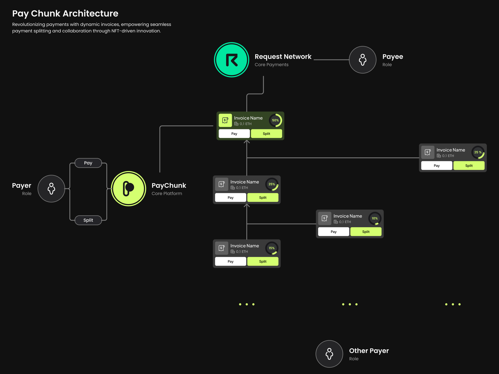

  

<b>
NFT platform allows splitting payment invoices
</b>

## 📋 Table of Contents

- [📋 Table of Contents](#-table-of-contents)
- [🌟 Introduction](#-introduction)
  - [Why Request Network?](#why-request-network)
  - [🎯 Product Goal](#-product-goal)
- [👥 User Stories](#-user-stories)
- [❗ Problem Statement](#-problem-statement)
- [💡 PayChunk Solution](#-paychunk-solution)
- [🛠️ Architecture Diagram](#️-architecture-diagram)
- [📋 Requirement Analysis](#-requirement-analysis)

## 🌟 Introduction

**PayChunk** is a revolutionary platform for dynamic invoicing, allowing businesses and individuals to create, manage, and split invoices based on NFTs (ERC-721) and Request Network protocols. 

### Why Request Network?

PayChunk uses Request Network as its core component for invoice creation and payment. Here’s why Request Network is the ideal choice:

**1. Transparency:**  
Request Network ensures that every financial transaction đều được thấy trên blockchain.

**2. Automation with Smart Contracts:**  
By integrating the Request Network, PayChunk automates the creation and processing of payment requests seamlessly, especially integrating split invoicing while preserving the nature of the protocol.

**3. Cost-Effectiveness:**  
Request Network reduces transaction costs compared to traditional payment systems by leveraging blockchain technology, making it an efficient solution for bill payments.

**4. Compliance and Security:**  
Request Network supports compliance with international standards for payments,

**5. Privacy:**
Request Network ensures GDPR-compliant privacy, encrypting request data accessible only to involved parties on the blockchain.

### 🎯 Product Goal

Pay Chunk aims to redefine invoice management by integrating dynamic pricing, split and share invoices for flexible and transparent payments in the form of NFTs. By leveraging the Request Network, Pay Chunk empowers businesses and individuals to adapt their finances to modern needs.

## 👥 User Stories

- **As a business owner (or payee)**, As a business owner (or payee), I want to issue invoices that automatically adjust to fluctuating market prices or variable consumption levels.
- **As a payer**, As a payer, I want to split invoice payments among contributors dynamically, ensuring fair cost distribution.

## ❗ Problem Statement

**1. Limited Flexibility for Shared Payments**
Current solutions do not support seamless invoice splitting across multiple contributors, creating logistical challenges.

**2. Rigid payment structure**
A rigid payment structure does not support flexible changes because invoices are fixed.

**3. Inefficiency in invoice management**
With dynamic invoices that can be split, an application is needed that helps manage and track multiple parent and child invoices easily at the same time

**4. Risks with traditional authorization methods**
The traditional payment sharing method is to authorize invoices but focuses on a single person, which is prone to risks leading to discrepancies

## 💡 PayChunk Solution

PayChunk addresses invoicing pain points and challenges by leveraging blockchain technology along with Request Network’s efficient payment technology, ensuring a seamless and transparent experience for all users. Here’s how PayChunk addresses the identified issues:

**1. Dynamic Invoices**
Create flexible invoices with Request Network

**2. Split Invoice Protocol**
Allow payers to split invoices into multiple separate sub-invoices that are linked to the main invoice, allowing for shared invoice payments between members. Enhanced tracking and streamlined financial allocation.

**3. NFT-backed Invoices**
Each invoice is represented as an NFT, allowing for traceability and supporting sharing protocols, ownership verification, and additional integrations such as collateral or risk assessment.

**4. Smart Contracts for Automation**
Smart contracts automatically trigger payments, ensuring funds are released upon completion of milestones or pre-defined conditions.

**5. Canvas supports easy management of multiple parent-child invoices at the same time**
Develop DApps that help users easily manage multi-tier invoices combined with Request Network

## 🛠️ Architecture Diagram

## 📋 Requirement Analysis

**1. Dynamic Pricing and Adjustments**
Invoices must allow real-time price updates based on agreed conditions, such as market rates or service levels.

**2. Payment Splitting and Contribution Tracking**
Enable splitting payments among multiple contributors while ensuring that the final destination aligns with the original invoice.

**3. Blockchain Transparency**
Leverage blockchain technology to provide a secure, transparent, and immutable record of invoices and payments.

**4. Automation via Smart Contracts**
Utilize smart contracts for automated payment triggers based on milestones or completion of conditions.

**5. Ease of Use**
Develop an intuitive user interface for creating, managing, and tracking invoices and payments.

**6. Scalability and Global Reach**
Support payments in multiple currencies and tokens, ensuring accessibility for users worldwide.

**7. NFT Integration**
Utilize NFTs to represent invoices, enabling ownership verification and potential collateralization or integration with other financial services.

**8. Compliance and Securit**y
Ensure all operations are GDPR-compliant and prioritize user data security with encryption and privacy measures.
